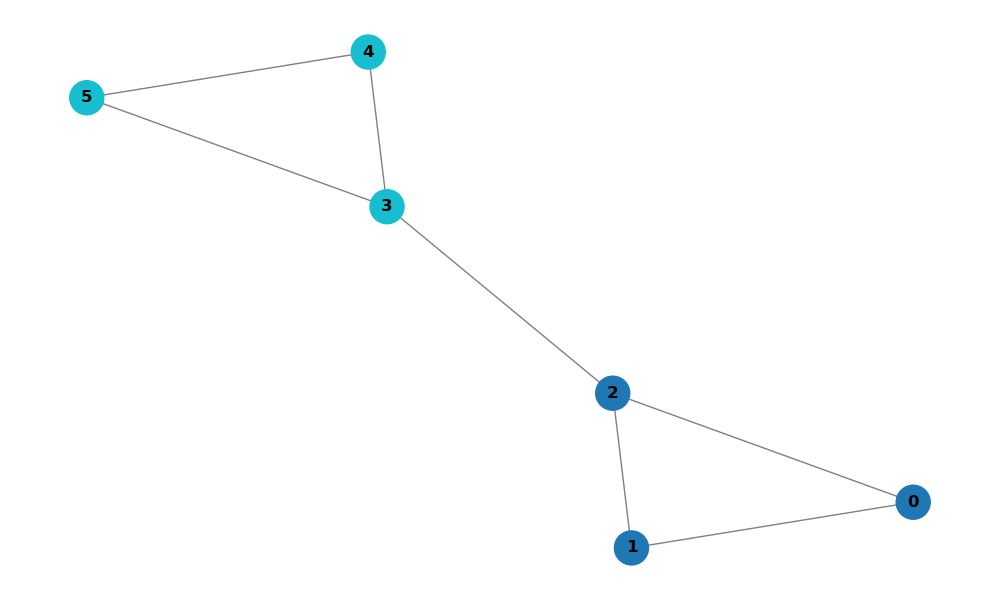
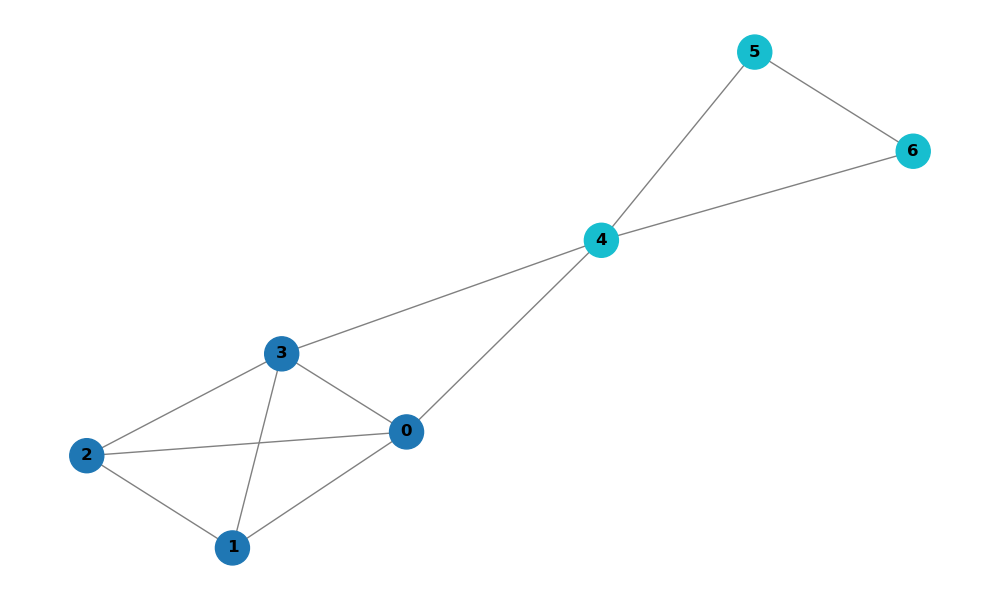
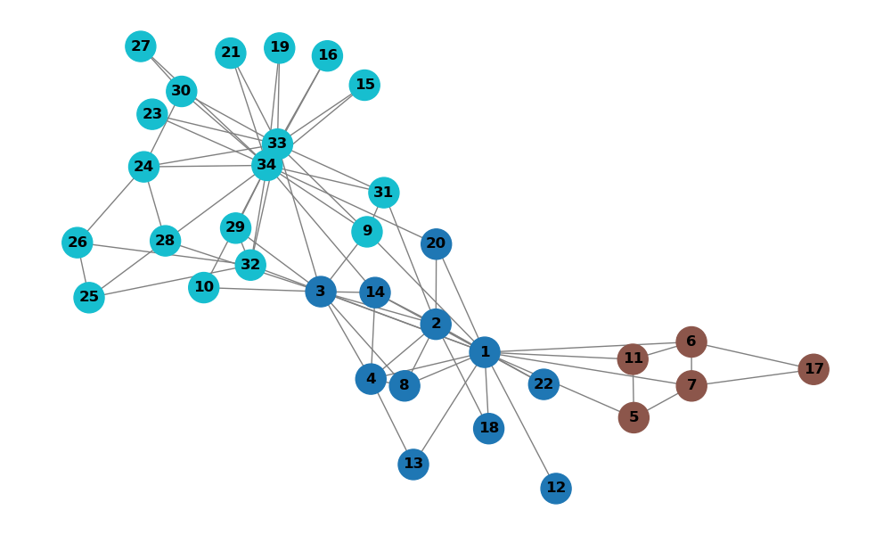

# Detecção de Comunidades em Redes

**Nomes:** Arthur Vieira Silva e Matheus Barbosa Brandão

## 📖 Objetivo:

O objetivo do trabalho prático é exercitar nossas habilidades em Python, manipulação de matrizes, gerenciamento de ambientes virtuais e controle de versão. Vamos implementar um algoritmo de **Detecção de Comunidades** em redes/grafo (baseado no algoritmo **Label Propagation** - Propagação de Rótulos). Além disso, um ambiente isolado com **Conda** deverá ser configurado.

## 🖥️ Tecnologias

- **Linguagem**: Python

## 🧠 Bibliotecas Utilizadas

- **sys**
- **csv**
- **random**
- **netoworkx**
- **numpy**
- **matplotlib**
- **collections**

## ✏️ Instruções

### Clonagem do repositório

```bash
git clone https://github.com/mathb366/RedesSociais.git
```

### Criação do ambiente

```bash
conda create --file environment.yml
```

### Ativar o ambiente

```bash
conda activate venv
```

### Desativar o ambiente

```bash
conda deactivate
```

### 📊 Relatório dos Testes

#### **rede1_duas_comunidades.csv**:
  - Grafo composto por 6 nós e 7 arestas;
  - Um dos resultados foi duas comunidades;
  - O algoritmo convergiu rapidamente com apenas 2 iterações;
  - Rótulos: {0: 1, 1: 1, 2: 1, 3: 4, 4: 4, 5: 4};
  - Imagem gerada:
  

#### **rede2.csv**:
  - Grafo composto por 7 nós e 11 arestas;
  - Um dos resultados foi duas comunidades;
  - O algoritmo convergiu rapidamente com apenas 2 iterações;
  - Rótulos: {0: 1, 1: 1, 2: 1, 3: 1, 4: 6, 5: 6, 6: 6};
  - Imagem gerada:
  

#### **zachary.csv**:
  - Grafo composto por 34 nós e 78 arestas;
  - Um dos resultados foi três comunidades;
  - O algoritmo convergiu com 15 iterações;
  - Rótulos: {2: 2, 1: 2, 3: 2, 4: 2, 5: 1, 6: 1, 7: 1, 8: 2, 9: 33, 11: 1, 12: 2, 13: 2, 14: 2, 18: 2, 20: 2, 22: 2, 32: 33, 31: 33, 10: 33, 28: 33, 29: 33, 33: 33, 17: 1, 34: 33, 15: 33, 16: 33, 19: 33, 21: 33, 23: 33, 26: 33, 24: 33, 30: 33, 25: 33, 27: 33};
  - Imagem gerada:
  

### Dificuldades

- Inicialmente, pensamos que os rótulos iniciais dos vértices seriam atribuídos de 0 até um valor fixo K para que não houvesse empate. No entanto, após vermos que a função para definir a moda dos vértices considera empate aleatório, os rótulos iniciais foram definidos como os índices dos vértices;
- Tivemos dificuldade em saber quando utilizar listas ou alguns métodos do numpy, principalmente, para manipular os rótulos;
- Além disso, fizemos a leitura dos arquivos csv de entrada considerando que não terão cabeçalhos, para que não seja necessário ignorar a primeira linha do arquivo.
- Também tivemos um dificuldade em como acessar um rótulo no dicionário para plotar o grafo do arquivo zachary.csv, no qual inicialmente estávamos acessando rótulos inexistentes.
