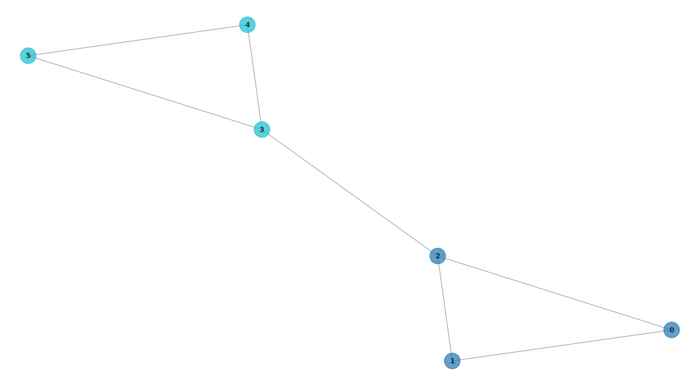
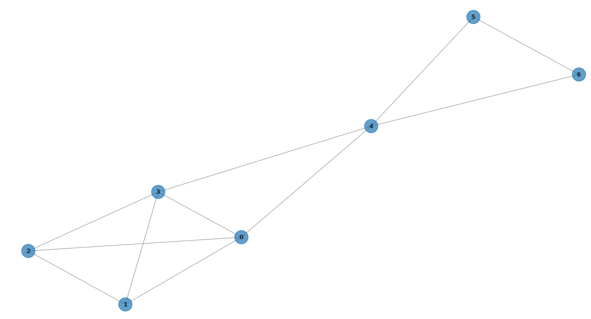
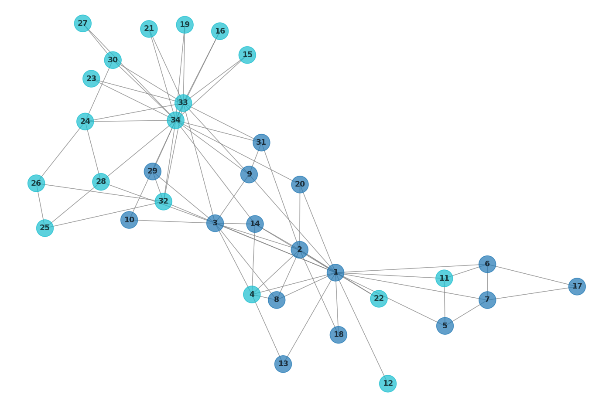
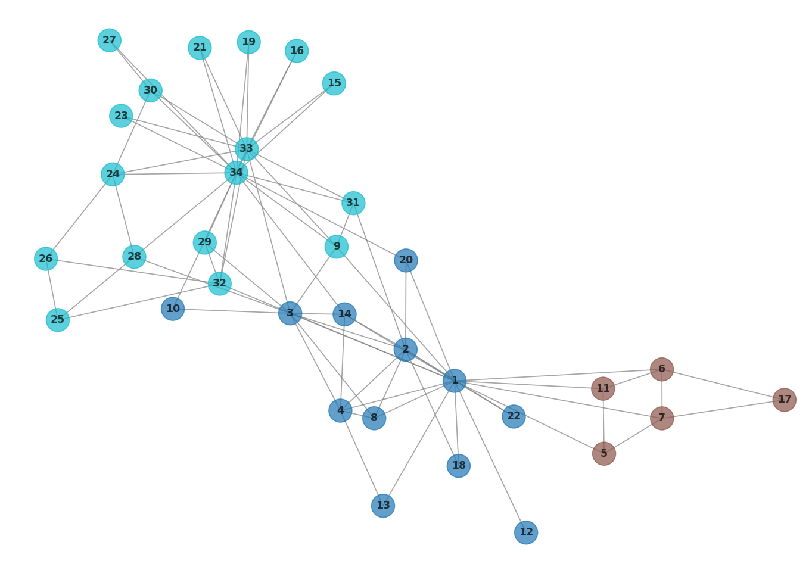

# Detecção de Comunidades em Redes

## 📖 Objetivo:

O objetivo do trabalho prático é exercitar nossas habilidades em Python, manipulação de matrizes, gerenciamento de ambientes virtuais e controle de versão. Vamos implementar um algoritmo de **Detecção de Comunidades** em redes/grafo (baseado no algoritmo **Label Propagation** - Propagação de Rótulos). Além disso, um ambiente isolado com **Conda** deverá ser configurado.

## 🖥️ Tecnologias

- **Linguagem**: Python

## 🧠 Bibliotecas Utilizadas

- **sys**
- **csv**
- **random**
- **netoworkx**
- **numpy**
- **matplotlib**

## ✏️ Instruções

### Clonagem do repositório

```bash
git clone https://github.com/mathb366/RedesSociais.git
```

### Criação do ambiente

```bash
conda create --file environment.yml
```

### Ativar o ambiente

```bash
conda activate venv
```

### Desativar o ambiente

```bash
conda deactivate
```

### Imagens da plotagem
- **Arquivo: Rede1**


- **Arquivo: Rede2**


- **Arquivo: zachary**



